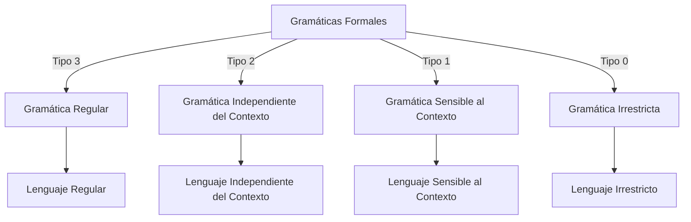
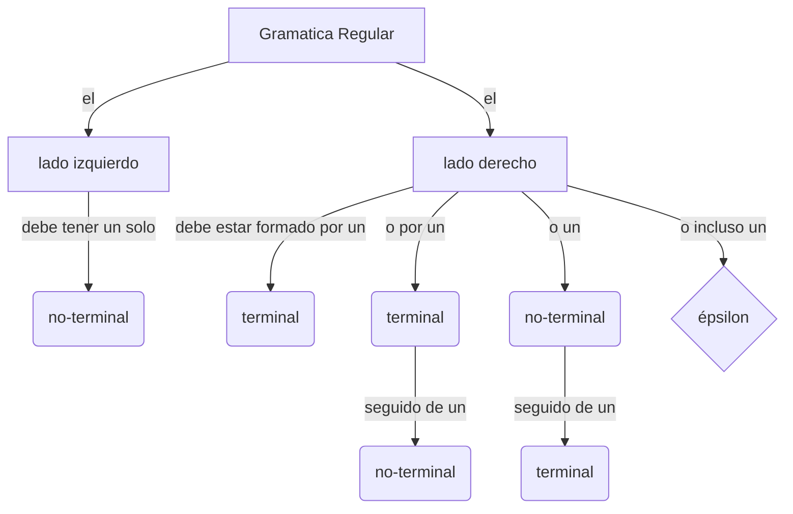
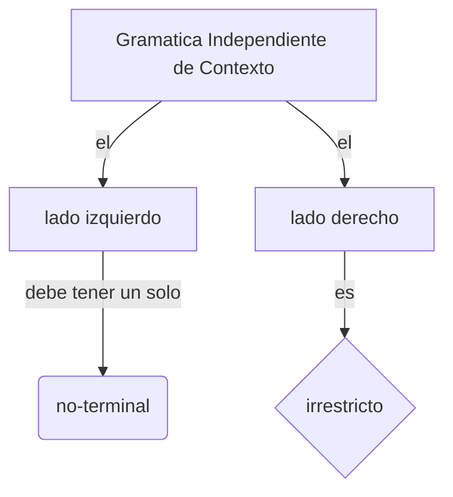
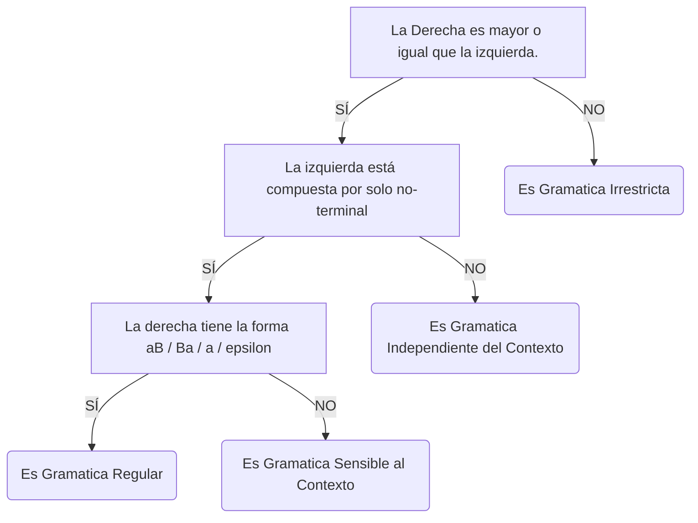

## 2.1 Gramáticas Formales:
> Conjunto de reglas (PRODUCCIONES) que se aplican para obtener las palabras del Lenguaje Formal que genera la Gramática Formal en cuestión.
#### 2.1.1 Composición:

G = ( Vn ; Vt ; P ; S )

*Referencias:*
- Vn : Vocabulario o alfabeto de no terminales.
- Vt : Vocabulario o alfabeto de terminales.
- P : Producciones.
- S : Símbolo o variable inicial.

*Requisitos:*
- Vn y Vt son conjuntos finitos.
- Vn ∩ Vt = ∅
- P es finito, y P⊂( V+ - Vt* ) X V* , siendo V = Vn ∪ Vt .
- S pertenece a Vn .
#### 2.1.2 Producciones:
Se construyen haciendo uso de Productores (también conocidos como variables), los símbolos que componen al "Σ" del lenguaje y metasímbolos como -> o como | .
*Ejemplo:*

G = ( { S, X, Y } ; { 0 , 1 } ; P ; S )

*Siendo P:*

S ⟹ 0S | 10X X ⟹ 1X | 0Y   Y ⟹ 0

*Traducido:* 
- S se puede reemplazar por 0S o por 10X.
- X se puede reemplazar por 1X o por 0y.
- Y se puede reemplazar por 0.
#### 2.1.3 De la gramática al lenguaje
1. Se comienza en el símbolo o variable inicial.
2. Se aplican producciones hasta obtener solamente elementos terminales, las letras del "Σ" del lenguaje.
Este proceso se conoce como **DERIVACIÓN**.
*Ejercicio:*

G = ( { S, T, Q } ; { a , b } ; P ; S )

*Siendo P:*

S ⟹ aT | bQ T ⟹ a | b   Q ⟹ a | ε

**a)** Puedo crear la cadena *bab*?
**b)** Que lenguaje se genera?

  
<b>Solución:</b>

  
  a) No. b)

L ={aa, ab, ba, b}

  

 

## 2.2 La Jerarquía de Chomsky:
> Esta Jerarquía de Chomsky establece una clasificación de cuatro tipos de Gramáticas Formales que, a su vez, generan cuatro tipos diferentes de Lenguajes Formales.

Las gramáticas no son entidades separadas, si no que están contenidas dentro de las otras.
![[Jerarquia-De-Chomsky.png]]

#### 2.2.1 Gramática regular:

#### 2.2.2 Gramática Independiente de Contexto:

#### 2.2.3 Gramática Sensible al Contexto:

<b>a ⟹ b&emsp;⇔&emsp;|b| ≥ |a|</b>

#### 2.2.4 Gramática Irrestricta:
Pueden existir secuencias de no-terminales y/o terminales, con α ≠ ε

#### EXTRA 1: Ayuda-memoria:

