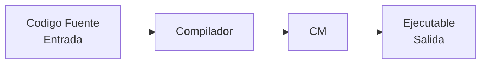
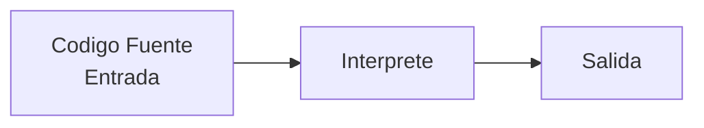
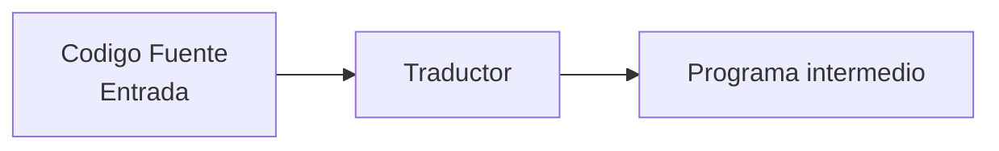
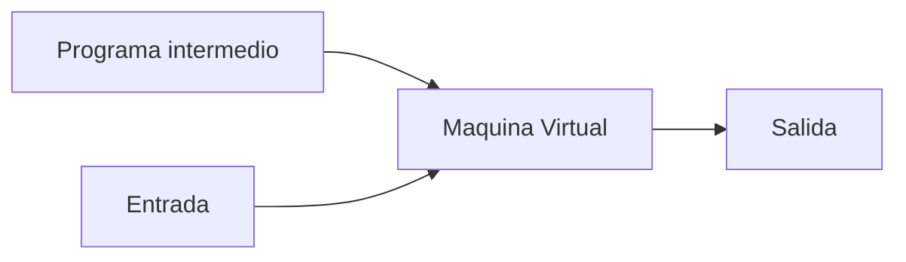

# Clase 1 - Introducción
### Análisis Léxico, Sintáctico, Semántico
Partimos de una sentencia inicial:

<center>buela baca la</center>

##### Análisis Léxico:
Errores lexicográficos en los componentes de las estructuras sintácticas.

<center>Vuela vaca la</center>

##### Análisis Sintáctico:
Error sintáctico, estructura incorrecta de la frase.

<center>La vaca vuela.</center>

##### Análisis Semántico:
Error semántico, volar no está en el contexto de la vaca.

### Lenguajes Formales (LF)
##### Componentes
Los lenguajes formales están compuestos de:
- *Símbolos/caracteres:* El elemento básico de construcción, la entidad fundamental indivisible a partir de la cual se forman los *alfabetos*. Un carácter puede ser *a*, *1*, *56*, *hola*, etc.
- *Alfabeto $(\Sigma)$:* Conjunto finito de caracteres con los que se construyen los lenguajes.
- *Cadenas:* Concatenación finita de caracteres tomados de un $\Sigma$. Poseen propiedades.
	- *Longitud de cadena $(\text{|S|})$:* Es la cantidad de caracteres que la componen.
	- *Cadena vacía $(\LARGE\varepsilon\normalsize)$:* Es la cadena que no tiene caracteres $(|S|=0)$. El símbolo $\LARGE\varepsilon$ no pertenece a ningún alfabeto.
	- *Potenciación $(a^n)$*: $a^5b^4$ es $aaaaabbbb$.
	- *Concatenación:* La producción de una nueva cadena compuesta de los caracteres de una primera cadena inmediatamente seguidos por los caracteres de la segunda. No es conmutativa.
	- *Prefijo*: Secuencia de cero o más caracteres iniciales de una cadena.
	- *Sufijo*: Secuencia de cero o más caracteres finales de una cadena.
$$\text{Pre(abcd) = }\large\varepsilon\normalsize\text{, a, ab, abc, abcd.}\qquad\text{Suf(abcd) = }\large\varepsilon\normalsize\text{, d, cd, bcd, abcd.}$$

- *Subcadena*: Cadena que se obtiene eliminando cero o más caracteres iniciales o finales de una cadena. Pueden eliminarse finales e iniciales simultáneamente.

- *Palabra*: Cadena que pertenece a un LF.
##### Descripción
- Se definen como un conjunto de cadenas formadas con caracteres de un alfabeto.

- Son abstractos, por lo que importa es la forma de una cadena (su sintaxis) y no su significado (su semántica). No tienen ambigüedad

- Pueden ser infinitos, no porque sus palabras sean de tamaño infinito si no por tener una cantidad infinita de palabras.

### Lenguajes Naturales (LN)
##### Características
1. *Evolucionan*: Incorporan nuevos términos o reglas para mejorar la comunicación con el paso del tiempo.
2. *Reglas emergentes:* Las reglas gramaticales surgen después del nacimiento del lenguaje, para poder explicar su sintaxis.
3. *Semántica sobre Sintaxis*: Usualmente, el significado de las palabras y oraciones de un lenguaje natural son más importantes que su composición sintáctica.
4. *Ambigüedad*.

### Lenguaje Universal (LU)
El lenguaje universal sobre un alfabeto $\Sigma$ es un lenguaje *infinito* que contiene todas las palabras que se pueden formal con los caracteres que componen a $\Sigma$, más la palabra vacía.

# Clase 2 - Intérpretes, Compiladores y código
### Compilador
Programa que permite traducir código fuente (lenguaje de alto nivel, humano) a lenguaje de nivel inferior (código de maquina / CM).

##### Ejemplos de lenguajes compilados:
C, C++, GO.

##### Proceso de compilación
1. *Preprocesamiento*: El procesador toma el fuente y lo limpia para la compilación. Elimina comentarios, saltos de linea y tabulaciones y resuelve directivas.
2. *Compilación*: El compilador toma el fuente preprocesado y realiza dos fases.
	1. *Análisis*: Realiza un análisis léxico, sintáctico y semántico.
	2. *Síntesis*: Genera un programa en *assembler*.
3. *Ensamblado*: Traduce el fichero escrito en *assembler* a código de máquina, ejecutable por el procesador mismo.
4. *Enlazado*: Agrupa los módulos objeto (.c) generados por el ensamblador, dando como salida un programa que el SO puede cargar y ejecutar.

##### Compilado con gcc  (en terminal)
```bash
 gcc -o miejecutable hola.c # genera miejecutable.exe
 gcc -E hola.c -o hola.i    # preprocesa hola.c y lo guarda en hola.i
 gcc –S hola.c  # compila hola.c hasta assembler (hola.s), sin generar binario
 gcc –o hola.o hola.s # traduce un .s a CM (binario) y genera un .o
 gcc –c –o hola.o hola.c # toma el .c y llega hasta la generación del .o
```
Notar que todos estos comandos incluyen a los que les preceden, por lo que el paso 2 sería paso 1 y paso 2 combinados.
### Interprete
Programa que toma linea por linea el código fuente y lo traduce en tiempo real. Tiene menor velocidad que el compilador.


### Compilador híbrido



### Código (printf y scanf)
##### Funciones Básicas de Formato
- *Equivalencias*: 
	- C++: `cin` (entrada) / `cout` (salida)
	- C: `scanf` (entrada) / `printf` (salida)

- **`int scanf(const char*, ...);`** → Lectura formateada desde `stdin` (entrada estándar).
- **`int printf(const char*, ...);`** → Escritura formateada sobre `stdout` (salida estándar).


##### Especificadores de Conversión
Se utilizan dentro de la cadena de texto de `scanf` y `printf` para definir el tipo de dato:

| **Carácter** | **Significado**                                                          |
| ------------ | ------------------------------------------------------------------------ |
| **c**        | Convierte el argumento `int` a `unsigned char` para generar un carácter. |
| **d**        | `int` decimal.                                                           |
| **i**        | `int` decimal, octal o hexadecimal.                                      |
| **e**        | `Double`.                                                                |
| **f**        | `float`.                                                                 |
| **g**        | Usa `%e` o `%f`, el más corto en `long`.                                 |
| **o**        | Lee un entero octal corto.                                               |
| **s**        | Lee una cadena de caracteres.                                            |
| **u**        | Lee un entero decimal sin signo (`unsigned`).                            |
| **x**        | Lee un entero hexadecimal.                                               |
| **[...]**    | Cadena de caracteres que incluye espacios.                               |
| **p**        | Puntero.                                                                 |

##### Comportamiento y Sintaxis
- *Manejo de argumentos:*
    - Si hay _menos_ argumentos que formatos: el comportamiento es **indefinido**.
    - Si hay _más_ argumentos que formatos: los sobrantes se evalúan normalmente pero son **ignorados**.

- *Retorno*: Se produce cuando la función llega al final de la cadena de formatos.

- *Estructura de la especificación de conversión:*
    `% [banderas] [ancho] [precisión] especificador`
    
- *Ejemplos prácticos*:
    - `printf("%.2f", a);` _(Ej: Imprime la variable 'a' con 2 lugares decimales)_
    - `printf("%8d", a);` _(Ej: Imprime la variable entera 'a' reservando un ancho de 8 espacios)_

# Clase 3 - Gramáticas formales, jerarquía de Chomsky y derivación
### Gramáticas formales (GF)
##### ¿Que son?
Son un conjunto de reglas, llamadas **producciones**, que se aplican para obtener una de las palabras del LF que la GF genera.

##### Definición formal
<center>4-upla (Vn, Vt, P, S)</center>
Siendo:
- *Vn*: no-terminales o variables (un conjunto finito).
- *Vt*: terminales o caracteres del $\Sigma$ sobre el cual se construye el LF.
- *P*: El conjunto finito de producciones.
- *S*: Símbolo inicial / axioma.
##### Producciones
Se construyen con tres tipos de símbolos:
- Símbolos productores.
- Los símbolos que forman las palabras del lenguaje creado.
- Metasímbolos como ->, el cual será llamado operador de producción.

##### Ejemplo
Tenemos las siguientes producciones y alfabeto:
```
S -> aT | bQ
T -> a | b
Q -> a | ε
```
	$\Sigma={b,a}$

Estas producen el siguiente lenguaje:
$$\large\text{L = {aa, ab, ba, b}}$$

### Jerarquía de Chomsky
La **jerarquía de Chomsky** es una clasificación de gramáticas formales que divide los lenguajes en cuatro niveles según su complejidad y el poder del "autómata" necesario para procesarlos. Va desde el Tipo 3 (*Regulares*), que son los más simples y se procesan con autómatas finitos, pasando por el Tipo 2 (*Independientes de contexto*) y Tipo 1 (*Sensibles al contexto*), hasta llegar al Tipo 0 (*Irrestrictos*), que son los más complejos y requieren una Máquina de Turing. Cada nivel superior incluye por completo al anterior.

| **Gramática Formal**                 | **Lenguaje Formal**                 |
| ------------------------------------ | ----------------------------------- |
| Gramática Regular                    | Lenguaje Regular                    |
| Gramática Independiente del Contexto | Lenguaje Independiente del Contexto |
| Gramática Sensible al Contexto       | Lenguaje Sensible al Contexto       |
| Gramática Irrestricta                | Lenguaje Irrestricto                |
##### Gramática regular (GR)
La GR tiene unas reglas fijas que restringen como se compone:
- El lado izquierdo debe tener un solo no-terminal y nada más.
- El lado derecho debe estar formado por:
	- Un solo terminal o un terminal seguido de un no-terminal.
		o (exclusivo)
	- Un solo terminal o un no-terminal seguido de un terminal.
		Una GR solo puede usar uno de los dos formatos de lado derecho para todas sus producciones.
	- Además, el lado derecho puede ser $\large\varepsilon$ (creando producciones-épsilon).

##### Gramática independiente de contexto (GIC)
- El lado izquierdo debe tener un solo no-terminal y nada más.
- El lado derecho es irrestricto.

##### Gramática sensible al contexto (GSC)
- El lado izquierdo debe ser distinto de $\large\varepsilon$.
- El lado derecho debe ser igual o más largo que el izquierdo.

##### Gramática irrestricta (GI)
- El lado izquierdo debe ser distinto de $\large\varepsilon$.

##### Gramática Quasi-Regular (GQR)
Una GQR es una forma de abreviar la escritura de una GR y siempre puede ser re-escrita como una GR.
- *GR:*
$$\text{S -> N | NS}$$
$$\text{N -> a | b | c}$$

- *GQR:*
$$\text{S -> a | b | c | aS | bS | cS}$$
##### EXTRA: Lenguajes infinitos en las Gramáticas Formales
Las GF son perfectamente capaces de crear LF infinitos, haciendo uso de producciones recursivas. Estas se definen haciendo uso de un no-terminal a la izquierda y el mismo no-terminal a la derecha.

### Derivación
La derivación es el proceso que permite obtener cada una de las palabras de un LF a partir de su GF, aplicando sucesivamente producciones convenientes de esa misma GF.
##### Ejemplo
- Producciones:
	- S -> ST
	- S -> ab
	- T -> aaT
	- T -> b
- Derivación:
	1. S
	2. ST
	3. STT
	4. abTT
	5. abaaTT
	6. abaabT
	7. abaabaaT
	8. abaabaab
	9. Listo! Palabra.

# Clase 4 - 

# Clase 5 - BNF y ER
### Sintaxis
- Un **Lenguaje de Programación** (LP) es una notación utilizada para describir algoritmos y estructuras de datos que resuelven problemas computacionales. La descripción precisa de la sintaxis del LP se realiza en notaciones llamadas **BNF**, similares a las GF de la Clase 3.
- Cada **Categoría Léxica o Token** (ya sean identificadores, números enteros, caracteres, cadenas constantes, operadores o signos de puntuación) se define mediante un **lenguaje regular (LR)** diferente.
- Las expresiones y las sentencias de un LP son, en general, LICs. Los llamaremos Categorías Sintácticas.

### EXTRA: Gramática Léxica de C

* `<token>` ->
    `<palabra reservada>` |
    `<identificador>` |
    `<constante>` |
    `<literal de cadena>` |
    `<puntuador>`
    
	* `<palabra reservada>` -> *una de*
	    auto break case char const continue default do
	    double else enum extern float for goto if
	    int long register return short signed sizeof static
	    struct switch typedef union unsigned void volatile while


* `<token de preprocesamiento>` ->
    `<nombre de encabezado>` |
    `<identificador>` |
    `<número de preprocesador>` |
    `<constante carácter>` |
    `<literal de cadena>` |
    `<puntuador>` |
    cada uno de los caracteres no-espacio-blanco que no sea uno de los anteriores
    
	* `<identificador>` ->
	    `<no dígito>` |
	    `<identificador>` `<no dígito>` |
	    `<identificador>` `<dígito>`

		* `<no dígito>` -> *uno de*
		    _ a b c d e f g h i j k l m n o p q r s t u v w x y z
		    A B C D E F G H I J K L M N O P Q R S T U V W X Y Z
		
		* `<dígito>` -> *uno de* 0 1 2 3 4 5 6 7 8 9

### Lenguajes Regulares y Expresiones Regulares
##### Condiciones para ser Lenguaje Regular

- Si un Lenguaje Formal es **finito** $\implies$ es un Lenguaje Regular.

- Si un Lenguaje Formal es **infinito** $\implies$ es un Lenguaje Regular o un Lenguaje no Regular

- Si un lenguaje es generado por una Gramática Regular $\implies$ es un Lenguaje Regular.

- Si un lenguaje puede ser reconocido por un Autómata Finito $\implies$ es un Lenguaje Regular.

- Si un L puede ser representado mediante una **Expresión Regular** $\implies$ es un LR.

##### Expresiones Regulares
Una ER es una expresión que describe todo el conjunto de cadenas que son palabras de su LR.
Es una secuencia de caracteres que actúa como modelo para la coincidencia y manipulación de series con reglas claramente definidas.
Se construyen con:
- El alfabeto sobre el que se define el LR.
- El símbolo épsilon ($\large\varepsilon$).
- Operadores especiales.
- E incluso paréntesis ().

##### Operadores
- *Épsilon $(\large\varepsilon\normalsize)$*: Cadena vacía.
- *Concatenación $(\ .)$*: Unir un elemento atrás de otro, $\text{a.b = ab}$.
	- No es conmutativa.
	- Tiene mayor precedencia que la unión.
- *Unión $(+)$*: Funciona como un $\large\vee$ lógico, $(\text{a+b = a})\vee(\text{a+b = b})$.

- *Factorización*:
$$\text{abb+aab = a(b+a)b}$$
$$\text{ab(b+a) = abb+aba}$$

- *Equivalencia*:
$$\text{aa+ab+ba+bb = a(a+b)+b(a+b)}$$
$$\text{a(a+b)+b(a+b) = (a+b)(a+b)}$$
$$\text{aa+ab+ba+bb = (a+b)(a+b)}$$
##### Operadores para LR infinitos
- *Clausura de Kleene $(*)$*: Genera una cadena formada por un número $\geq$ 0 a elección de repeticiones de su operando. Entonces $\text{a* = aaaa}$ o $\text{a* = }\varepsilon$ o $\text{a* = aaaa}$.
- *Clausura positiva $(^+)$*: Genera una cadena formada por un número $\geq$ 1 a elección de repeticiones de su operando. Entonces $\text a^+ = aaaa$ o $\text a^+ = a$ pero $\text a^+ \neq\large\varepsilon$.

##### Expresión Regular Universal
La ERU es la ER que es capaz de expresar todas las combinaciones posibles de caracteres dentro de un alfabeto determinado, incluyendo $\large\varepsilon$.

##### Operaciones con conjuntos
- *Unión*    
    - Si $L_1$ es representado por $a^*b$ y $L_2$ es representado por la $a+b^*$, $L_1 \cup L_2$ es representado por $a^*b + a+b^*$.

- *Concatenación*
    - $L_1.L_2$ cada palabra está formada por la concatenación de una palabra de $L_1$ con una de $L_2$.
        
    - Sea $L_1 = \{ab, cd\}$ y sea $L_2 = \{aa, acc, ad\}$. Entonces: $L_1L_2 = \{abaa, abacc, abad, cdaa, cdacc, cdad\}$ y su cardinalidad es 6.

- *Complemento*:
	- El complemento de un lenguaje $L_1$  está formado por todas aquellas palabras que no pertenecen a $L_1$.

##### ER extendidas con operadores no oficiales
| **Operador**            | **Descripción y Ejemplo**                                                                                                                                                                                       |
| ----------------------- | --------------------------------------------------------------------------------------------------------------------------------------------------------------------------------------------------------------- |
| **. (punto)**           | Se corresponde con cualquier carácter, excepto el "nueva linea" (\n). Ejemplo: a.a representa cualquier cadena de tres caracteres en la que el primer carácter y el tercer carácter son a.                      |
| **\| (barra vertical)** | Es el operador unión de ERs. Ejemplo: abb representa la ER ab+b.                                                                                                                                                |
| **[] (corchetes)**      | Describe un conjunto de caracteres. Simplifica el uso del operador "unión". Ejemplo: [abx] representa la ER a+b+x.                                                                                              |
| **[-]**                 | Describe una clase de caracteres en uno o más intervalos. Ejemplo 1: [a-d] representa la ER a+b+c+d. Ejemplo 2: [0-9a-z] representa cualquier dígito decimal o cualquier letra minúscula (del alfabeto inglés). |
| **{} (llaves)**         | Es el operador potencia, una repetición determinada del patrón que lo precede como operando. Ejemplo 1: a{3} representa la ER aaa. Ejemplo 2: (ab){4} representa la ER abababab.                                |
| **{,}**                 | Es el operador potencia extendido a un intervalo. Ejemplo: a{1,3} representa la ER a+aa+aaa.                                                                                                                    |
| **?**                   | Es un operador que indica cero o una ocurrencia de la ER que lo precede. Ejemplo: a? representa la ER ats.                                                                                                      |
| *****                   | Es el operador clausura de Kleene: cero o más ocurrencias de la ER que lo precede. Ejemplo: a representa la ER a*.                                                                                              |
| **+**                   | Es el operador clausura positiva: una o más ocurrencias de la ER que lo precede. Ejemplo: a+ representa la ER a*.                                                                                               |
| **() (paréntesis)**     | Se utilizan para agrupar una ER. Ejemplo: ((ab)? \| b)+ representa la ER $(ab+\varepsilon+b)*$.                                                                                                                 |

# Clase  6 - Autómatas
### ¿Qué es un autómata?
Un autómata es un mecanismo que permite reconocer lenguajes formales, determinando que cadenas son parte del lenguaje y rechazando las que no pertenecen
### Autómatas y la Jerarquía de Chomsky
| **G. Formal -> genera:** | **L. Formal -> reconocido por:** | **Autómata**             |
| ------------------------ | -------------------------------- | ------------------------ |
| GR                       | LR                               | Autómata Finito          |
| GIC                      | LIC                              | Autómata Finito con Pila |
| GSC                      | LSC                              | Máquina de Turing        |
| G. Irrestricta           | L. Irrestricto                   | Máquina de Turing        |

### Autómatas finitos (AF)
- Un AF recorre los caracteres que constituyen la cadena a evaluar, con cada carácter procesado produciendo un cambio de estado en el autómata.
- Si al finalizar se encuentra en un Estado Final (+), entonces se ha reconocido la cadena.
- Un AF puede tener varios Estados Finales (+), pero un solo Estado Inicial (-).
- Todo AF tiene asociado un dígrafo llamado Diagrama de Transiciones (DT), cuyos nodos representan los distintos estados del AF y cuyos arcos que representan las transiciones entre estados.

### Definición formal de un AFD
La definición formal de un AFD es una **5-upla (Q, $\Sigma$, T, q0, F).**
En la que:
- *Q* es un conjunto finito de estados.
- $\Sigma$ es el alfabeto de caracteres reconocidos por el autómata.
- *q0* es el estado inicial único.
- *F* es el conjunto de estados finales.
- *T*: Tabla de transiciones, conformada por las relaciones $Q\times\Sigma$.

##### Tabla de Transición
Es otra forma de mostrar la función de transición.
![[Pasted image 20260707005754.png]]

|       | a     | b     |
| ----- | ----- | ----- |
| $0^-$ | 1     | -     |
| $1$   | $2^+$ | $3^+$ |
| $2^+$ | -     | -     |
| $3^+$ | $3^+$ | -     |

