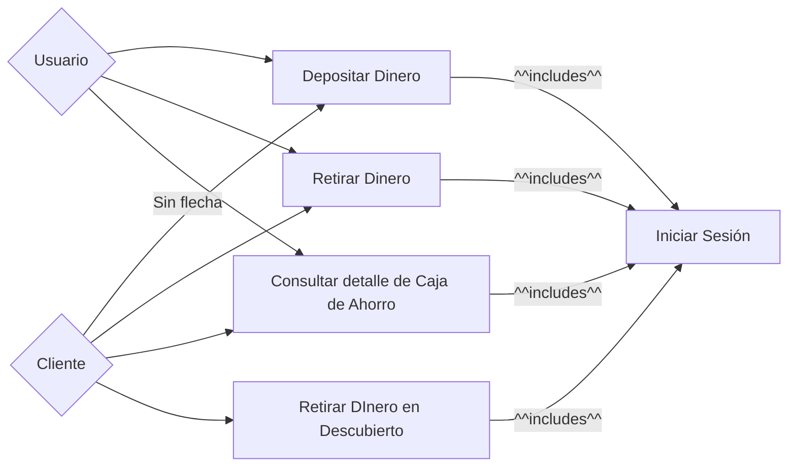
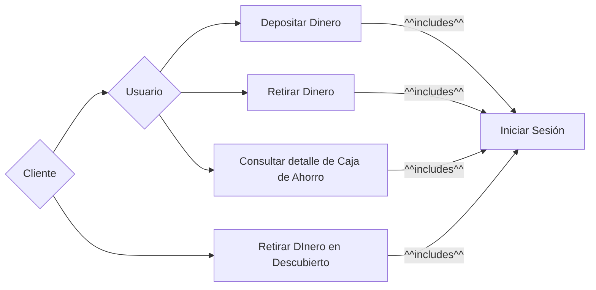

# Práctica
## Requerimientos
#### Ejercicio 7:
##### a) Busque 2 requerimientos funcionales y 2 requerimientos no funcionales.
**Ideas propuestas**:
**Funcional:**
- El sistema debe almacenar la cantidad de puntos de cada piloto.
- El sistema debe registrar circuitos y su tipo.
- El sistema debe limitar la cantidad de pilotos habilitados a correr para una misma escudería.
- El sistema debe almacenar el código, nombre y premio a otorgar de cada carrera.
- El sistema debe "saber" la nacionalidad del piloto y su escudería.
- El sistema debe permitir habilitar - deshabilitar circuitos.

**No Funcional:**
- El sistema debe garantizar que el ID de cada vehículo sea único.
- Cada carrera debe tener distancia, nombre, ciudad y cantidad de curvas.
- El sistema debe registrar la cantidad de puntos por piloto según la posición en la que termine en la carrera.
- Pilotos deben contar con la superlicencia de FIA para competir.
- Los vehículos deberían usar la última tecnología disponible.

**Correcciones**:
**Funcional:**
- El sistema debe almacenar la cantidad de puntos de cada piloto. 
	- Hay que ser mas especifico.
	- *El sistema debe almacenar la cantidad de puntos de cada piloto por carrera.*
- El sistema debe registrar circuitos y su tipo.
	- No es algo para lo que se use el sistema, el sistema no está para registrar los circuitos y su tipo $\implies$ Es No Funcional.
- El sistema debe limitar la cantidad de pilotos habilitados a correr para una misma escudería.
	- Es mas una restricción que algo que debe hacer el sistema $\implies$ Es No Funcional.
	- *El sistema debe limitar la cantidad de pilotos habilitados a correr para una misma escudería a un máximo de 2.*
- El sistema debe almacenar el código, nombre y premio a otorgar de cada carrera.
	- No es algo para lo que se use el sistema, el sistema no está para almacenar el código, nombre y premio a otorgar de cada carrera  $\implies$ Es No Funcional.
- El sistema debe "saber" la nacionalidad del piloto y su escudería.
	- No es algo para lo que se use el sistema, el sistema no está para almacenar la nacionalidad del piloto  $\implies$ Es No Funcional.
- El sistema debe permitir habilitar - deshabilitar circuitos.
	- CORRECTO.

**No Funcional:**
- El sistema debe almacenar la cantidad de puntos de cada piloto.
	- Ni idea realmente.
	- *Cada coche debe tener un ID único.*
- El sistema debe registrar la cantidad de puntos por piloto según la posición en la que termine en la carrera.
	- Es Funcional.
- Pilotos deben contar con la superlicencia de FIA para competir.
	- Si la FIA se encarga de calcular si un corredor tiene la superlicencia o no, es Funcional. Si es solo un chequeo True/False es No Funcional.
- Los vehículos deberían usar la última tecnología disponible.
	- Nada que ver.
## Casos de Uso
#### Partes:
- Sistema.
- Actores.
- Casos de uso.
- Relaciones.
- Los próximos ejercicios tendrán especificación.
#### Ejercicio 241:
1. Definir si es un software o un sistema, en la mayoría es claro que se quiere.
2. Definir de que es el sistema / software.
3. Darle nombre a los agentes, mientras mas especifico en contexto pero permisivo mejor.
4. Los casos de uso son los objetivos, no los medios para cumplirlos. Deben ser acciones
##### SW de Transacciones de Banco
___

___
o
___

___