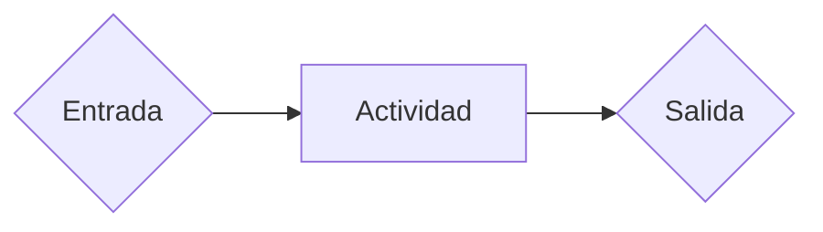
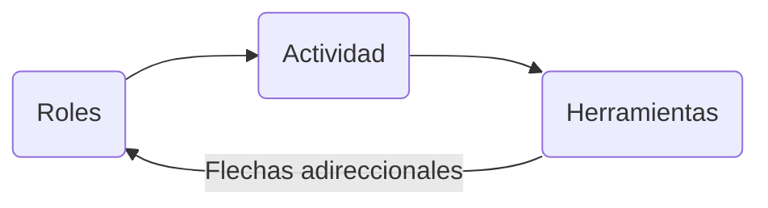
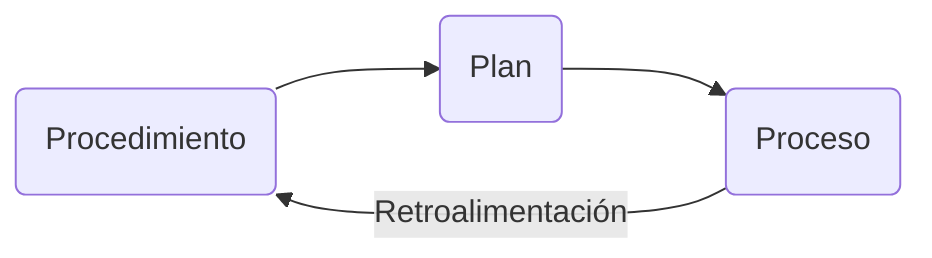

## Temas a futuro
- Proyecto
- Plan
	- Tabla
	- CPM/Gant
- Gestión riesgos
- Gestión configuración
- Gestión calidad

## Procesos, Planes y Proyectos
- **Proceso**:Secuencia de pasos generalizados, que reciben una entrada y una salida y se siguen para alcanzar un objetivo. No todos los pasos son obligatorios.
	- **Proceso de negocio**: Procesos que describen actividades necesarias para cumplir objetivos de negocio.
	- Los procesos se generan a partir de la necesidad y se modifican iterativamente en base a resultados previos en busca de eficiencia.

___
- **Procedimiento**: Detalle especifico de acciones, permite variación para llegar al mismo objetivo, la implementación específica del proceso.
___
- **Plan**: Define que estrategia usar, establece que pasos del proceso se llevan a cabo y cuales no.
___
- **Proyecto**: Lleva a la práctica un plan en el que alcanzar objetivos específicos para satisfacer necesidades mediante actividades reales. Es único, tiene un inicio y un fin claramente definidos, utiliza recursos y produce resultados.
	- Todo calendarizado y con una duración establecida: El principio, las actividades que lo componen, baches de tiempo y el fin.
		- Para evitar errores de *dependencia* entre los pasos.
		- Las actividades, quien las realiza, su fecha y duración se describen en el **plan de proyecto** (Gant).
	- Tiene un alcance definido, establecido en el *anteproyecto*.
		- Si incluye la adquisición de los recursos,
		- Si incluye la "entrega" del proyecto.
		- A cuanta gente voy a necesitar en base a lo que haga.
		- Cuanto tiempo voy a terminar necesitando.
	- Existe una **retroalimentación** desde el **proyecto** de vuelta al **plan**.
	- **Gestión de proyecto**: Existe un líder de proyecto que se encarga de asegurar que las actividades se cumplan en tiempo y forma. Esta persona es la que realiza la gestión de proyecto.

- **Riesgo**: Evento a futuro que de ocurrir afecta al proyecto de alguna forma. Tiene una exposición al riesgo:
$$Exposicion\ al\ riesgo=Probabilidad\ de\ Ocurrencia\ \cdot \ Impacto$$
	- En respuesta al riesgo puedo actuar, no hacer nada o transferirlo a alguien afuera del equipo.
- **Punto trigger**: El punto en el tiempo en el que un riesgo se hace realidad. Depende del problema si puede o no resolverse luego del *punto trigger*.
- **Plan de mitigación**: Los planes que se ejecutan antes del punto trigger, buscan disminuir la *exposición* a un riesgo.
- **Plan de contingencia**: Los planes que se ejecutan luego del punto trigger, buscan disminuir el *impacto* del problema.