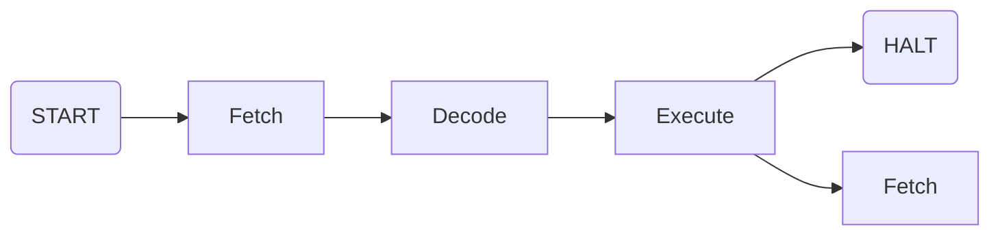
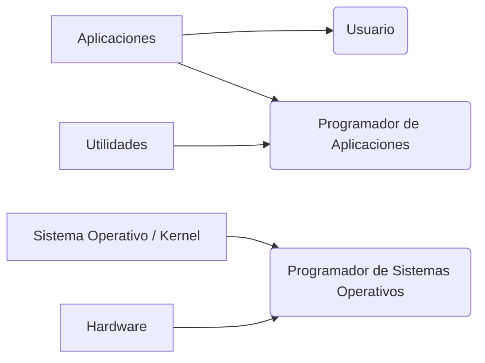

# 1. Repaso de Arq. de Comp.
### 1.1 Componentes Básicos de una Computadora
- **Procesador**: Registros + ALU + CU.
- **Registros**: Memoria interna de la CPU. Se dividen en:
	- *Registros de uso general*: Son visibles por el usuario, pueden ser escritos y leídos. Se usan, por ejemplo, para guardar resultados o números intermedios de una cuenta (AX, BC, etc.).
	- *Registros de control y estado*: Usualmente no pueden ser escritos por el programador, sí leídos. Los utiliza el HW o el SO para tener idea de su situación actual. Entre ellos se encuentran:
		- IP: La dirección en memoria de la siguiente instrucción a ejecutarse.
		- IR: El op-code de la instrucción en que se está ejecutando en ese instante.
		- MAR: La dirección de lo que se buscará en la RAM, sea operando o instrucción.
		- MBR: Lo buscado en la RAM, sea operando o instrucción.
		- FLAGS: El estado del procesador luego de realizar una operación (OF, CF, ZF, etc.).
- **Memoria RAM**: Almacenamiento primario y volátil de una computadora que guarda lo datos e instrucciones que la CPU necesita procesar en tiempo real.
- **Bus**: Dispositivo capaz de transferir datos entre componentes de una computadora (CPU, I/O, MP, etc.) . Compuesto por:
	- Bus de datos.
	- Bus de direcciones.
	- Bus de control.
### 1.2 Instrucciones
La CPU tiene un set de instrucciones, que indica que funciones puede realizar.
*Ejemplo*:
```C
	i=i+1;
```
No es una instrucción para la CPU, sino un conjunto de instrucciones, también llamado sentencia. La CPU la ejecutaría de la siguiente forma:
```Assembly
MOV AC, [100Ah]
ADD AC, 0001h
MOV [100Ah], AC
```
##### 1.2.1 Tipos de instrucciones
Existe una extensa clasificación de instrucciones, para SO nos importa si son:
- **Instrucciones no privilegiadas**: Cualquier programa puede ejecutarlas.
	Por ejemplo: `MOV, ADD, SUB, JNZ, JZ, CALL`, etc.
- **Instrucciones privilegiadas**: Solo puede ejecutarlas el SO.
	Por ejemplo: `CLI, STI, INT, HIT`, etc.
##### 1.2.2 Ciclo de vida de instrucción sin interrupciones
El ciclo básico de instrucción, no contempla interrupciones durante su ejecución.

Las tres etapas contempladas en la cursada de SO son:
- **Fetch**: La CPU busca en memoria la siguiente instrucción a ejecutar, cuya dirección está almacenada en el IP.
- **Decode**: La CPU decodifica la instrucción, traduciéndola para conocer que operación es y que operandos debe buscar. Se almacena el el IR.
- **Execute**: La CPU ejecuta la instrucción.
Una vez completado el ciclo se reinicia, habiendo hecho IP+=1 si se siguió con el flujo normal o PC=pos. si se realizó un `JMP`.
> Solo pueden ejecutarse los programas que se encuentren en la RAM.
### 1.3 Interrupciones
##### 1.3.1 Definición
Mecanismo de HW mediante el cual se le indica a la CPU que ha ocurrido un evento. Suelen provenir de algún módulo I/O, de la MP o de la misma CPU.
Cuando se interrumpe un programa se guarda su contexto de ejecución (los valores de los registros) en la pila, para luego pasar a la rutina de interrupción, lo cual representa un cambio a nivel kernel. Una vez completada la rutina se decide si se vuelve a ejecutar la instrucción anterior o una nueva interrupción si es que llegó una.
##### 1.3.2 Clasificación
**Proveniencia**:
- Internas: Generadas por la propia CPU, de SW.
- Externas: Generadas por el resto de componentes, de HW. Incluyen, por ejemplo, eventos asociados a un dispositivo de E/S, proviniendo de esos mismos.
**Enmascarabilidad**:
- Enmascarables (MI): No son atendidas inmediatamente, pueden ser ignoradas temporalmente ya que no representan eventos críticos. Pueden ser desactivadas con un bit en el registro FLAGS.
- No enmascarables (NMI): Son atendidas inmediatamente, no pueden ser ignoradas ya que representan un evento crítico. Incluyen, por ejemplo, las fallas de HW.
> Depende de la arquitectura, la cual define que interrupción es o no enmascarable.

**Sincronicidad**:
- Sincrónicas: Generadas como resultado de instrucciones, son internas.
- Asincrónicas: Generadas por dispositivos externos al procesador, independientes del ciclo de ejecución.
**De reloj**: Indican a la CPU que debe desalojar el proceso que está ejecutando actualmente, usadas para la planificación de la CPU y permitir multiprogramación.
##### 1.3.3 Excepciones
Subgrupo de interrupciones, generadas por errores en la programación o condiciones anómalas de CPU. Son de muy alta prioridad y se dividen en:
- **Faltas / Errores**: Las que se pueden detectar y corregir antes de que se ejecute la instrucción que las genera.  
	*Ejemplo:* Fallo de página.

- **Trampas**: Las que se detectan una vez ejecutada la instrucción que las genera.
	*Ejemplo:* Overflow

- **Abortos**: Las que se detectan sin poder localizar la instrucción que las genera, abortando la ejecución del programa.
	*Ejemplo:* Un valor no inválido en un registro de sistema.
##### 1.3.4 Ciclo de instrucción con interrupciones
![[Ciclo-Interrupciones.png]]
Pasos que se dan en el proceso de interrupción:
- **CPU**:
	1. Se genera la interrupción.
	2. Se espera a finalizar la instrucción actual.
	3. Se determina si ha ocurrido una interrupción y su proveniencia.
	4. Se almacenan el IP y el registro FLAGS en la pila.
	5. Se carga en el IP la dirección de la rutina (localizada en el manejador de interrupciones) y comienza a ejecutarla el SO.
- **SO**:
	6. Se almacena el resto del contexto de ejecución en la pila (registros auxiliares).
	7. Se inhabilitan las interrupciones (no siempre).
	8. Se procesa la rutina de la interrupción en su totalidad.
	9. Se recuperan los registros auxiliares y el FLAGS.
	10. Se recupera el IP.
	11. Se rehabilitan las instrucciones (si se inhabilitaron previamente).
##### 1.3.5 Múltiples interrupciones en simultaneo
Suele ocurrir que surja una interrupción mientras se está atendiendo otra. Se puede resolver
- Atendiéndolas en orden de llegada.
- Atendiéndolas en orden de prioridad, lo cual requiere que previamente se haya definido un nivel de prioridad para cada instrucción.
- Deshabilitándolas durante el procesamiento de una interrupción.
### 1.4 Jerarquía de memoria
Hay una gran variedad de espacios de almacenamiento dentro de una computadora. Se utilizan para distintos objetivos, y se ordenan en la siguiente jerarquía:
**Volátiles**: Se vacían al quitarles corriente.
1. Registros de la CPU
2. Memoria Caché
3. Memoria RAM
**No volátiles:** No se vacían al quitarles corriente.
4. Discos de estado sólido
5. Discos magnéticos
6. Discos Ópticos
7. Almacenamiento fuera de linea (cintas)
A mayor jerarquía mayor velocidad y costo. A menor jerarquía mayor tamaño.
> **¿Que es suspender una computadora?**
> Es simplemente mantener un poco de energía en la memoria y mover la información de registros volátiles a registros no volátiles. Al despertar a la computadora, todo vuelve a su lugar original.
# 2. Nociones básicas de Sistemas Operativos
### 2.1 Introducción
##### Nociones básicas de un Sistema Operativo:
Un Sistema Operativo (SO) es un programa o conjunto de programas que administran realiza/n las siguientes funciones:
- Administrar la ejecución de programas.
- Proveer una UI para usuarios y programadores.
- Administrar recursos de HW y SW.
- Administrar los dispositivos de E/S.
- Administrar archivos.
- Administrar la comunicación entre programas.
- Asignar recursos de CPU y memoria a programas.
- Brindar protección al sistema completo.
- Administrarse a sí mismo.
##### Capas de una computadora:
Todo SO tiene un núcleo donde se ejecutan las funciones básicas, pero necesita también ejecutar aplicaciones externas o mostrar la interfaz por ejemplo, por lo que se divide en capas con distinto acceso:
- **Kernel**: El núcleo del SO, gestiona recursos y provee funcionalidad básica, además de permitir sincronización y comunicación entre procesos.
- **Distribuciones**: Son sistemas operativos basados en un núcleo que incluyen además determinados paquetes de SW con aplicaciones para usos específicos. Ubuntu, Fedora y Arch son algunas distribuciones de Linux.
	- Aplicaciones: Programas destinados a usuarios finales, precisan al SO como intermediario para acceder al HW. 
	- Utilidades: Recursos usados por los programadores para interactuar con el SO y el HW.

##### Evolución de los Sistemas Operativos:
- **Monoprogramados**: Permite la ejecución de un solo programa a la vez, el cual dispone de todos los recursos disponibles. Esto resulta en un procesamiento en serie, permitiendo crear lotes simples de programas y en que orden se ejecutarán.
- **Multiprogramados**: Permite la ejecución de multiples programas de forma concurrente. El SO debe encargarse de distribuir los recursos disponibles entre los procesos