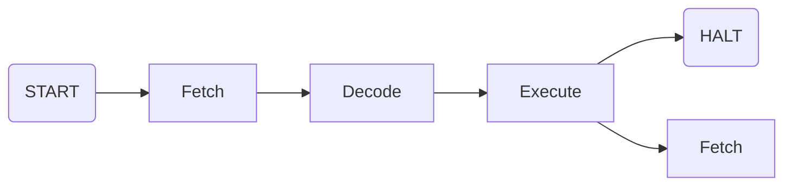
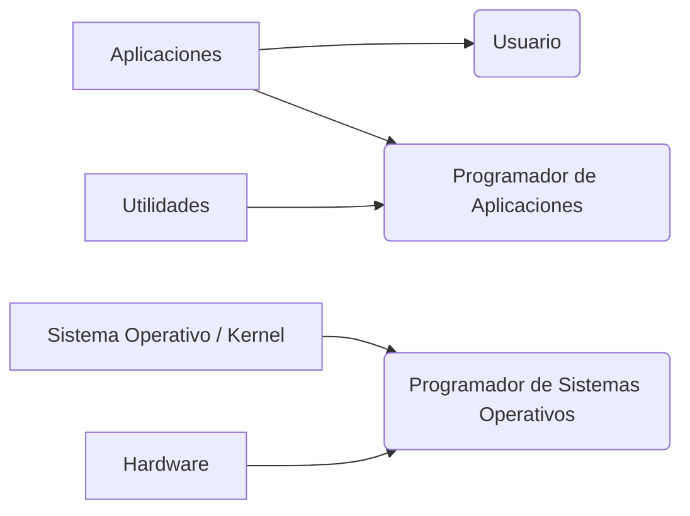

# 1. Repaso de Arquitectura de Computadoras
### 1.1 Componentes Básicos de una Computadora
- **Procesador**: Registros + ALU + CU.
- **Registros**: Memoria interna de la CPU. Se dividen en:
	- *Registros de uso general*: Son visibles por el usuario, pueden ser escritos y leídos. Se usan, por ejemplo, para guardar resultados o números intermedios de una cuenta (AX, BC, etc.).
	- *Registros de control y estado*: Usualmente no pueden ser escritos por el programador, sí leídos. Los utiliza el HW o el SO para tener idea de su situación actual. Entre ellos se encuentran:
		- PC (IP en x86): La dirección en memoria de la siguiente instrucción a ejecutarse.
		- IR: El op-code de la instrucción en que se está ejecutando en ese instante.
		- MAR: La dirección de lo que se buscará en la RAM, sea operando o instrucción.
		- MBR: Lo buscado en la RAM, sea operando o instrucción.
		- FLAGS: El estado del procesador luego de realizar una operación (OF, CF, ZF, etc.).
- **Memoria RAM**: Almacenamiento primario y volátil de una computadora que guarda lo datos e instrucciones que la CPU necesita procesar en tiempo real.
- **Bus**: Dispositivo capaz de transferir datos entre componentes de una computadora (CPU, I/O, MP, etc.) . Compuesto por:
	- Bus de datos.
	- Bus de direcciones.
	- Bus de control.
### 1.2 Instrucciones
La CPU tiene un set de instrucciones, que indica que funciones puede realizar.
*Ejemplo*:
```C
	i=i+1;
```
No es una instrucción para la CPU, sino un conjunto de instrucciones, también llamado sentencia. La CPU la ejecutaría de la siguiente forma:
```Assembly
MOV AC, [100Ah]
ADD AC, 0001h
MOV [100Ah], AC
```
##### 1.2.1 Tipos de instrucciones
Existe una extensa clasificación de instrucciones, para SO nos importa si son:
- **Instrucciones no privilegiadas**: Cualquier programa puede ejecutarlas.
	Por ejemplo: `MOV, ADD, SUB, JNZ, JZ, CALL`, etc.
- **Instrucciones privilegiadas**: Solo puede ejecutarlas el SO.
	Por ejemplo: `CLI, STI, INT, HIT`, etc.
##### 1.2.2 Ciclo de vida de instrucción sin interrupciones
El ciclo básico de instrucción, no contempla interrupciones durante su ejecución.

Las tres etapas contempladas en la cursada de SO son:
- **Fetch**: La CPU busca en memoria la siguiente instrucción a ejecutar, cuya dirección está almacenada en el PC.
- **Decode**: La CPU decodifica la instrucción, traduciéndola para conocer que operación es y que operandos debe buscar. Se almacena el el IR.
- **Execute**: La CPU ejecuta la instrucción.

Una vez completado el ciclo se reinicia, habiendo hecho PC+=1 si se siguió con el flujo normal o PC=pos. si se realizó un `JMP`.
> Solo pueden ejecutarse los programas que se encuentren en la RAM.
### 1.3 Interrupciones
##### 1.3.1 Definición
Mecanismo de HW mediante el cual se le indica a la CPU que ha ocurrido un evento. Suelen provenir de algún módulo I/O, de la MP o de la misma CPU.
Cuando se interrumpe un programa se guarda su contexto de ejecución (los valores de los registros) en la pila, para luego pasar a la rutina de interrupción, lo cual representa un cambio a nivel kernel. Una vez completada la rutina se decide si se vuelve a ejecutar la instrucción anterior o una nueva interrupción si es que llegó una.
##### 1.3.2 Clasificación
**Proveniencia**:
- Internas: Generadas por la propia CPU, de SW.
- Externas: Generadas por el resto de componentes, de HW. Incluyen, por ejemplo, eventos asociados a un dispositivo de E/S, proviniendo de esos mismos.

**Enmascarabilidad**:
- Enmascarables (MI): No son atendidas inmediatamente, pueden ser ignoradas temporalmente ya que no representan eventos críticos. Pueden ser desactivadas con un bit en el registro FLAGS.
- No enmascarables (NMI): Son atendidas inmediatamente, no pueden ser ignoradas ya que representan un evento crítico. Incluyen, por ejemplo, las fallas de HW.

> Depende de la arquitectura, la cual define que interrupción es o no enmascarable.

**Sincronicidad**:
- Sincrónicas: Generadas como resultado de instrucciones durante ejecución.
- Asincrónicas: Generadas por dispositivos externos al procesador, independientes del ciclo de ejecución.

**De reloj**: Indican a la CPU que debe desalojar el proceso que está ejecutando actualmente, usadas para la planificación de la CPU y permitir multiprogramación.
##### 1.3.3 Excepciones
Subgrupo de interrupciones, generadas por errores en la programación o condiciones anómalas de CPU. Son de muy alta prioridad y se dividen en:
- **Faltas / Errores**: Las que se pueden detectar y corregir antes de que se ejecute la instrucción que las genera.  
	*Ejemplo:* Fallo de página.

- **Trampas**: Las que se detectan una vez ejecutada la instrucción que las genera.
	*Ejemplo:* Overflow

- **Abortos**: Las que se detectan sin poder localizar la instrucción que las genera, abortando la ejecución del programa.
	*Ejemplo:* Un valor no inválido en un registro de sistema.
##### 1.3.4 Ciclo de instrucción con interrupciones
![[Ciclo-Interrupciones.png]]
Pasos que se dan en el proceso de interrupción:
- **CPU**:
	1. Se genera la interrupción.
	2. Se espera a finalizar la instrucción actual.
	3. Se determina si ha ocurrido una interrupción y su proveniencia.
	4. Se almacenan el PC y el registro FLAGS en la pila.
	5. Se carga en el PC la dirección de la rutina (localizada en el manejador de interrupciones) y comienza a ejecutarla el SO.
- **SO**:
	6. Se almacena el resto del contexto de ejecución en la pila (registros auxiliares).
	7. Se inhabilitan las interrupciones (no siempre).
	8. Se procesa la rutina de la interrupción en su totalidad.
	9. Se recuperan los registros auxiliares y el FLAGS.
	10. Se recupera el PC.
	11. Se rehabilitan las instrucciones (si se inhabilitaron previamente).

##### 1.3.5 Múltiples interrupciones en simultaneo
Suele ocurrir que surja una interrupción mientras se está atendiendo otra. Se puede resolver
- Atendiéndolas en orden de llegada.
- Atendiéndolas en orden de prioridad, lo cual requiere que previamente se haya definido un nivel de prioridad para cada instrucción.
- Deshabilitándolas durante el procesamiento de una interrupción.

### 1.4 Jerarquía de memoria
Hay una gran variedad de espacios de almacenamiento dentro de una computadora. Se utilizan para distintos objetivos, y se ordenan en la siguiente jerarquía:
**Volátiles**: Se vacían al quitarles corriente.
1. Registros de la CPU
2. Memoria Caché
3. Memoria RAM

**No volátiles:** No se vacían al quitarles corriente.
4. Discos de estado sólido
5. Discos magnéticos
6. Discos Ópticos
7. Almacenamiento fuera de linea (cintas)

A mayor jerarquía mayor velocidad y costo. A menor jerarquía mayor tamaño.
> **¿Que es suspender una computadora?**
> Es simplemente mantener un poco de energía en la memoria y mover la información de registros volátiles a registros no volátiles. Al despertar a la computadora, todo vuelve a su lugar original.
# 2. Nociones básicas de Sistemas Operativos
### 2.1 Introducción
##### 2.1.1 Nociones básicas de un Sistema Operativo:
Un Sistema Operativo (SO) es un programa o conjunto de programas que administran realiza/n las siguientes funciones:
- Administrar la ejecución de programas.
- Proveer una UI para usuarios y programadores.
- Administrar recursos de HW y SW.
- Administrar los dispositivos de E/S.
- Administrar archivos.
- Administrar la comunicación entre programas.
- Asignar recursos de CPU y memoria a programas.
- Brindar protección al sistema completo.
- Administrarse a sí mismo.

##### 2.1.2 Capas de una computadora:
Todo SO tiene un núcleo donde se ejecutan las funciones básicas, pero necesita también ejecutar aplicaciones externas o mostrar la interfaz por ejemplo, por lo que se divide en capas con distinto acceso:
- **Kernel**: El núcleo del SO, gestiona recursos y provee funcionalidad básica, además de permitir sincronización y comunicación entre procesos.
- **Distribuciones**: Son sistemas operativos basados en un núcleo que incluyen además determinados paquetes de SW con aplicaciones para usos específicos. Ubuntu, Fedora y Arch son algunas distribuciones de Linux.
	- Aplicaciones: Programas destinados a usuarios finales, precisan al SO como intermediario para acceder al HW. 
	- Utilidades: Recursos usados por los programadores para interactuar con el SO y el HW.

##### 2.1.3 Evolución de los Sistemas Operativos:
- **Monoprogramados**: Permite la ejecución de un solo programa a la vez, el cual dispone de todos los recursos disponibles. Esto resulta en un procesamiento en serie, permitiendo crear lotes simples de programas y en que orden se ejecutarán.
- **Multiprogramados**: Permite la ejecución de multiples programas de forma concurrente. El SO debe encargarse de distribuir los recursos disponibles entre los procesos.
	- *Sistemas en Lotes Multiprogramados*: permiten agrupar varios procesos y que mientras uno esté a la espera de algo, usualmente un evento de un dispositivo de E/S, pueda ejecutarse otro proceso del lote.
	- *Sistemas de Tiempo Compartido*: permiten ejecutar varios usuarios en simultaneo. La tarea de administración es más compleja, ya que no todos los usuarios poseen los mismos privilegios.

### 2.2 Llamadas al Sistema (Syscalls)
##### 2.2.1 Syscalls:
Funciones incluidas en el kernel del SO mediante las cuales un programa puede solicitar servicios al SO. Estos servicios suelen ser acceso a HW o a programas a los que solo puede acceder el SO. Las siguientes son Syscalls que puede hacer una aplicación para acceder a distintos servicios a los que normalmente no tendría acceso:
- Operaciones sobre archivos:`open(), read(), write()`
- Operaciones sobre procesos: `fork(), exit(), kill()`
- Manipulación de dispositivos: `release(), eject()`
- Otras: `time(), sem_wait()`

Cada SO tiene las suyas, con nombres y parametros distintos a las de otros SOs. Para resolver posibles problemas de compatibilidad se usan **Wrappers**.
##### 2.2.2 Wrappers:
Funciones estándares a todos los SOs y que realizan las llamadas al sistema. Los siguientes son beneficios del uso de wrappers:
- Portabilidad: Permiten ejecutar mi programa en cualquier SO.
- Simplicidad: Me ahorro detalles intrínsecos del SO que no son relevantes durante la programación de alto nivel.
- Eficiencia.

Usar las syscalls directamente permite más control pero conllevan menor simplicidad y portabilidad.
### 2.3 Modos de ejecución:
##### 2.3.1 Anillos:
Los SOs usan un sistema de "anillos de protección" (suele ir del 0 al 3) el cual permite  o no ejecutar ciertos tipos de instrucciones en base al anillo en el que nos encontremos. Usualmente se dividen en:
0. Kernel: Usado por el SO, permite ejecutar cualquier tipo de instrucción. Accedemos a él mediante syscalls.
1. Drivers: Usado generalmente por los drivers del sistema.
2. Idem. 2.
3. Usuario: No puede ejecutar instrucciones privilegiadas. Es acá donde se ejecutan las aplicaciones y programas, accediendo al nivel kernel únicamente mediante syscalls.

##### 2.3.2 Cambio de Modo (Mode Switch):
Un cambio de modo es, como su nombre indica, un cambio del modo de ejecución del sistema. Estos suceden constantemente ya que, por ejemplo:
- Si termina un proceso, se debe cambiar el modo a **kernel** para que el SO pueda decidir que otro proceso le sigue y, una vez elegido, darle el control (limitado) del sistema.
- Si se recibe una interrupción a la que se decide atender, el SO es el que se encarga de llamar su respectiva rutina.

> - Puedo conocer en que modo estoy revisando los bits que lo indican del PSW.
> - Si un programa intenta ejecutar una instrucción privilegiada, el SO le envía una señal para que finalice o realiza una acción similar. Se produce, como el nombre indica, una interrupción.
# 3. Procesos
### 3.1 Definiciones (repaso)
- **Programa:** Secuencia de instrucciones compiladas a código de máquina. Son estáticos, no dinámicos como los **procesos**.
- **Ejecución concurrente**: Múltiples programas siendo ejecutados en simultaneo, pero no en el mismo instante (una CPU no puede ejecutar dos instrucciones en el mismo instante), sino tomándose turnos para ir ejecutando sus partes.
- **Sistemas Monoprogramados**: SOs en los que la CPU solo puede ejecutar un programa por vez.
- **Multiprogramación**: Múltiples programas cargados en memoria siendo ejecutados simultáneamente en un solo procesador.
- **Multiprocesamiento**: Dos o más procesadores físicos trabajando en paralelo ejecutando tareas simultáneamente.

### 3.2 Anatomía de un proceso
Un programa siendo ejecutado en un instante determinado, con memoria y recursos asignados a su funcionamiento. Se puede entender como una instancia en acción de un programa. Son la unidad de trabajo del SO y se componen de los siguientes elementos:
- Una secuencia de instrucciones que debe ejecutar el procesador.
- Un conjunto de datos.
- Estado.
- Atributos.
- Recursos asignados a ellos previamente.

Es la estructura que permite que un conjunto de instrucciones se pueda ejecutar. Todo proceso debe estar representado en la memoria RAM.
**Entorno de un proceso**: Conjunto de variables que utiliza el proceso durante su ejecución.
##### 3.2.1 Estructuras que lo componen:
- **Código**: Espacio asignado a almacenar la secuencia de instrucciones del programa. Las instrucciones (ya en lenguaje de maquina) se cargan a la memoria. El proceso no puede modificar su propio código ni el de otro proceso.
- **Datos**: Espacio asignado para almacenar variables globales, las que no se definen durante el proceso. El proceso no puede modificar sus propios datos ni los de otro proceso.
- **Stack**: Espacio asignado para almacenar:
	- Variables locales, definidas dentro de una función.
	- En llamadas a funciones, se almacena en el stack la dirección a la que volver una vez terminada la ejecución de la función.
	- Parámetros.
	- Retornos de funciones.
	Se gestiona automáticamente y se borra al terminar la función. Los procesos pueden modificar el stack.
- **Heap**: Memoria que el programador se encarga de reservar y liberar en tiempo de ejecución en base a su necesidad. Demás está decir que el proceso puede modificarlo.

Ejemplo aclaración:
```C
int valor_inicial = 1;
// DATA

int main(){
	int total = sumar(valor_inicial, 2);
	// STACK
	char * mensaje = malloc(30);
	// STACK           HEAP
	
	sprintf(mensaje, "Total: %d", total);
	//       HEAP
	return 0;
}
```
- **PCB (Process Control Block)**: Espacio asignado para almacenar el contexto de ejecución de un proceso, especialmente usado en la multiprogramación. Existe uno por proceso y son creados y gestionados por el SO. Contiene la información para que el SO lo administre y pueda guardar su contexto en caso de un cambio de contexto. El PCB, siempre cargado en la RAM y solo en la CPU cuando se está ejecutando su respectivo proceso se compone de:
	- El PSW del proceso.
	- Identificadores:
		- PID: Identificador del proceso.
		- PPID: Identificador del padre del proceso.
		- UID: Identificador del usuario que inició el proceso. 
	- PC
	- Registros
	- Información para la planificación (usada por la CPU).
	- Información de manejo de memoria.
	- Información de E/S.
	- Información contable, como tiempo en CPU.

El proceso no puede modificar su propio PCB ni el de otro proceso.
> Si declaro un puntero se guardará en el stack la dirección del heap en la que se encuentra su contenido. Una vez finalizado el proceso, si no hago `free()` , se borra el puntero, pero no el dato en el heap, por lo que ahora hay algo en el heap al que no puedo acceder para borrarlo. Esto se conoce como fuga de memoria (*memory leak*).
##### EXTRA 1: Tiempo de vida de datos:
Todos los datos que son almacenados tienen un tiempo de vida. En C existen:
- Estáticas: Variables que se crean en la creación del proceso y se destruyen con la destrucción del mismo. Para crearlas se pueden crear afuera del `main()` o con el calificador `static`.
- Automáticas: Aquellas variables no declaradas con `static`. Se crean al entrar a su función y se destruyen al salir de ella.
- Asignadas: Aquellas variables almacenadas en la memoria que se reserva de forma dinámica, el heap.

### 3.3 Estados de un proceso
##### 3.3.1 Definiciones
- *Ciclo de vida de un proceso*: Tiempo que transcurre entre la inicialización y finalización de un proceso.
- *Estado de un proceso*: Indica en que condición se encuentra un proceso, su comportamiento en un dado instante.

##### 3.3.2 Diagrama de estados:
![[DiagramaDeEstados.png]]
- **Nuevo**: El proceso ya ha sido recibido por el SO y debe crear sus estructuras o inicializar su PCB para luego enviarlo a la memoria.
- **Listo**: El proceso se encuentra en una cola, listo para ser ejecutado. A mayor cantidad de programas en **listo**, mayor grado de multiprogramación. ^47ab0f
- **En ejecución**: La CPU está ejecutando / siendo usada por el proceso.
	- El proceso puede volver a **listo** sin pasar por **en espera** cuando, por ejemplo, se le termina el tiempo que tenía designado para su ejecución.
- **En espera**: El proceso ya comenzó su ejecución pero no puede continuarla porque realizó una *llamada bloqueante* y se encuentra a espera de un evento.
	- El proceso puede volver a **listo** solo si le indica al SO que el evento que esperaba finalizó, mediante una interrupción.
- **Suspendido en espera**: Al proceso que ocupa mucho espacio le envían todas sus estructuras (menos el PCB) al disco para liberar la RAM.
	- El proceso puede pasar a **suspendido listo** si el evento que estaba esperando se completó mientras este seguía en el disco.
- **Suspendido listo**: Al proceso que estuvo mucho tiempo **listo** y que ocupa mucho espacio le envían todas sus estructuras (menos el PCB) al disco para liberar la RAM. A mayor cantidad de programas en **suspendido listo**, menor grado de multiprogramación.
- **Finalizado**: El proceso finalizó su ejecución, se libera la memoria de todas sus estructuras menos el PCB.
	- Se puede pasar de cualquier estado a **finalizado** si así lo desea el SO.
	- Siempre que un proceso es **finalizado** se debe guardar su valor de retorno, además de su PCB para fines estadísticos/contables.

##### 3.3.3 Syscalls bloqueantes y no bloqueantes:
| **Situación**                                  | **Bloqueante**                                                          | **No bloqueante**                                                                    |
| ---------------------------------------------- | ----------------------------------------------------------------------- | ------------------------------------------------------------------------------------ |
| **Operación se puede realizar inmediatamente** | Realiza la operación y retorna el resultado.                            | Realiza la operación y retorna el resultado.                                         |
| **Operación no está lista (requiere espera)**  | La ejecución de ese programa se detiene hasta que la operación termine. | La ejecución del programa no se detiene y continúa con su siguiente línea de código. |
| **Valores de retorno**                         | Ok / Error                                                              | Ok / Error / Reintentar                                                              |
##### EXTRA 2: Estados en Linux:
- **R (runnable/running):** Es la conjunción de los estados **en ejecución** y **listo**.
- **S (sleep):** El equivalente de **en espera**.
- **D (uninterruptable sleep):** Estado "super en espera". No se puede interrumpir, generalmente asociado a operaciones de Entrada/Salida (I/O) críticas.
- **T (stopped):** El proceso ha sido detenido (por ejemplo, mediante una señal de control de trabajos).
- **Z (zombie):** Estado *exit*. El proceso terminó su ejecución, pero su PCB (Process Control Block) sigue en memoria hasta que el proceso padre lo reclama (recolecta su código de salida).
- **X (dead):** El proceso está completamente finalizado y eliminado.
- **+ (plus):** Indica que el proceso se encuentra ejecutándose en el primer plano.

### 3.4 Creación de un proceso
##### 3.4.1 Formas de crear un proceso:
- Lo crea el SO para proveer algún servicio.
- Lo crea otro proceso, siendo el nuevo el hijo del que lo creó. Padre e hijo/s pueden o ejecutarse en simultaneo o el padre esperar a que el/los hijo/s termine/n. Padre e hijo no tienen porqué ser similares.

##### 3.4.2 Pasos para crear un proceso:
1. Asignarle un PID.
2. Reservar espacio en memoria para sus estructuras.
3. Inicializar su PCB.
4. Ubicar su PCB en las listas de planificación.

##### 3.4.3 Tabla de procesos:
Cuando un proceso es creado se agrega a la tabla de procesos del sistema (TDP), la cual maneja el SO. A mayor cantidad de procesos de la TDP activos, mayor nivel de multiprogramación.
##### EXTRA 3: Crear procesos en Linux:
- Para crear un hijo se realiza la syscall `fork()`, a lo que el SO duplica el proceso padre, le da un nuevo PID, le agrega el PPID, y el resto de datos (registros, pila, heap, PC) se mantienen.
- Cuando proceso crea un hijo, el padre puede esperar a que termine, operar concurrentemente o incluso ejecutar distintas partes de un mismo programa.
- Puede ocurrir que el proceso sea la copia exacta del padre o que se le de una nueva imagen que reemplace la anterior (`execv`).
- Los recursos del hijo pueden ser directo del SO o estar restringidos a una parte de los procesos del padre.

### 3.5 Finalización de un proceso
##### 3.5.1 Formas de finalizar un proceso:
- Lo finaliza el SO con `kill()`.
- Lo finaliza otro proceso con `kill()`.
- El proceso se finaliza a si mismo, sea una salida *normal* o *anormal*.

##### EXTRA 4: Finalizar procesos en Linux:
- Para finalizar un proceso se realiza la syscall `exit()`.
- Si el proceso es hijo puede usar `wait()` para finalizar e indicar su resultado a su padre.
- Si el proceso es padre puede usar `abort()` para finalizar a su hijo, sea porque consumió recursos demás, porque su tarea es ya innecesaria, porque el padre debe terminar o porque el padre fue finalizado por el abuelo.

### 3.6 Cambio de proceso
Un cambio de proceso sucede cuando la CPU deja de ejecutar un proceso y comienza a ejecutar otro. Puede deberse a la necesidad de ejecutar otro proceso más urgente o a la llegada de una interrupción o una syscall.
Siempre se debe almacenar el *contexto de ejecución* del proceso original para poder reanudarlo una vez finalizado el nuevo. Esto causa overhead y se debe minimizar.
# 4. Planificación
### 4.1 Introducción
##### 4.1.1 Problemas de la multiprogramación
Cuando hay muchos procesos buscando ser ejecutados en simultaneo pueden surgir problemas como:
- Disparidad de tiempo de uso de la CPU entre procesos.
- Procesos que no llegan a ejecutarse nunca.
- Decrecimiento en el tiempo de respuesta del sistema.
- CPU en espera activa.
- RAM llena.

Esto resuelve con una correcta distribución de procesos, algo que se conoce como **planificación**. Esta permite asignar recursos de CPU a los distintos procesos existentes aumentando así el rendimiento y productividad de la maquina.
##### 4.1.2 Tipos de procesos por limitación
- **CPU bound**: Son aquellos procesos que requieren más tiempo de procesamiento en CPU que de espera de dispositivos de E/S.
- **IO bound**: Son aquellos procesos que requieren más tiempo de espera de dispositivos de E/S que tiempo de procesamiento en CPU.

### 4.2 Tipos de planificación.
Los nombres de los tipos de planificación que veremos a continuación (corto, mediano y largo plazo) hacen referencia a la frecuencia con la que intervienen en el comportamiento normal del sistema.
##### 4.2.1 Planificación de Largo Plazo
En la **planificación a largo plazo** se determinan que procesos pueden o no ser siquiera admitidos a la cola de **listo**. Además, puede enviar procesos al estado **finalizado** si es que el sistema está muy saturado de procesos.
Es por esto que esta es la planificación que agencia el grado de multiprogramación del sistema.
##### 4.2.2 Planificación de Mediano Plazo
En la **planificación a mediano plazo** se determinan los cambios de estado entre los de la RAM (listo, en ejecución, en espera, etc,) y los del disco (suspendido en espera y suspendido listo). Esta acción de enviar procesos del disco a la RAM y viceversa se conoce como **swapping**.
- Swap in: Cargar (nuevamente) en la RAM un proceso suspendido.
- Swap out: Pasar un proceso de la RAM al disco.

Es importante aclarar que esta planificación no maneja los cambios entre. por ejemplo, suspendido en espera y suspendido listo, si no que solo se encarga de los cambios que se cruzan de almacenamiento.
##### 4.2.3 Planificación de Corto Plazo
En la **planificación a corto plazo** se determina que proceso debe estar **en ejecución**. Esta planificación se lleva a cabo cada vez que un evento libera la CPU o llega un proceso de mayor importancia, por lo que está en efecto casi constantemente.
Para manejar los procesos bloqueados el SO posee listas/colas de bloqueados. Los algoritmos con los que las procesa se clasifican en:
- Sin desalojo: Una vez asignados a la CPU, los procesos se ejecutan hasta que decidan devolverle el control al SO.
- Con desalojo: El SO tiene la autoridad de interrumpir los procesos en plena ejecución, quitarles los recursos de CPU y dárselos a otro proceso. Esto pude suceder porque un proceso excedió su tiempo máximo permitido (*quantum*) o porque llegó un proceso con mayor prioridad.

### 4.3 Criterios de planificación
Para la planificación el SO debe basarse en ciertas métricas que reflejan el estado del funcionamiento del sistema. Se dividen en dos clases:
##### 4.3.1 Cuantitativos
- Tiempo de ejecución: Tiempo entre la solicitud de creación de un proceso hasta su finalización.
- Tiempo de espera: Tiempo obtenido al sumar todos los intervalos en los que el proceso estuvo en **ready**.
- Tiempo de respuesta: Tiempo entre la inicialización de un proceso y su primera respuesta, para nosotros eso es una llamada a E/S.
- Tasa de procesamiento: La cantidad de procesos finalizados en un intervalo específico de tiempo.
- Utilización de la CPU: El porcentaje de tiempo en el cual una CPU estuvo ocupada en un intervalo específico de tiempo. Mientras mas alto y menos ociosa la CPU, mejor.

##### 4.3.2 Cualitativos
- Previsibilidad: Criterio que hace referencia comportamiento que espera el usuario del sistema.
- Equidad/Imposición de recursos/Equilibrado de recursos: Criterio que hace referencia a que tan parejo se distribuyen los recursos entre los procesos.

### 4.4 Algoritmos de planificación
Cuando se ejecutan los procesos es algo que se decide mediante un algoritmo. Es importante aclarar que esto no incluye las llamadas a E/S, las cuales se atienden únicamente por **FIFO**. Para el resto de los procesos se usa:
##### 4.4.1 First In First Out (FIFO)
Los procesos entran a una cola en orden FIFO. La CPU procesa el primero, hasta que este termina o se bloquea. Una vez que una de estas dos situaciones se da, se realiza el siguiente proceso en la fila, y se aplica el mismo sistema. Cuando un proceso termina una operación bloqueante no se sigue realizando inmediatamente, sino que se envía al final de la cola, donde espera su turno hasta que le llegue.
Este algoritmo tiene el problema los procesos muy largos hacen que los procesos cortos que les siguen tarden mucho también.
##### 4.4.2 FIFO con prioridad
En este caso, además de tener un orden de llegada, los procesos tienen su nivel de prioridad. Este es un número entero, que en la práctica divide la cola **FIFO** en "niveles", los cuales se comportan cada uno como su propia cola. Si un proceso tiene un número de prioridad menor que otro entonces se ejecuta primero (0 es máxima prioridad). Si dos procesos tienen la misma prioridad, se hace por **FIFO**.
Este algoritmo tiene dos problemas principales:
- **Starvation**: Si hay un proceso con una prioridad muy baja (número de prioridad alto) es posible que nunca se ejecute si siguen llegando procesos con mayor prioridad.
Es importante aclarar que no existen realmente varias colas, el algoritmo simplemente se comporta como si ese fuera el caso.
##### 4.4.3 Shortest Job First (SJF) sin desalojo 
Se ejecuta primero el proceso cuya próxima ráfaga de CPU sea la más corta, a menos que haya dos procesos con la misma duración de próxima ráfaga, en cuyo caso se decide por FIFO.
El problema es que es imposible saber que tan larga será la próxima ráfaga de CPU de un proceso. Esto se soluciona mediante una estimación del tiempo que tardará la siguiente ráfaga del proceso que viene. Para realizar esta estimación nosotros usaremos la siguiente fórmula:
$$EST_{N+1}=\alpha\cdot TE_n+\left(1-\alpha\right)\cdot EST_n$$
Siendo:
- $TE_n=$ Tiempo de ejecución de la ráfaga actual
-  $EST_n=$ Tiempo estimado de la ráfaga actual.
- $EST_{n+1}=$ Tiempo estimado de la siguiente ráfaga.
- $\alpha=$ Constante entre 1 y 0, usada para determinar si se le da mas peso a la predicción de la ráfaga actual o su longitud real.

De esta información pueden obtenerse las siguientes conclusiones:
- A mayor estabilidad en el programa, mayor atención al historial a largo plazo, menor $\alpha$. 
- A menor estabilidad en el programa, mayor atención a los cambios inmediatos, mayor $\alpha$.
- Este algoritmo tiene mucho overhead, por lo que debe usarse con precaución.
##### 4.4.4 SJF con desalojo  / Shortest Remaining Time (SRT)
A diferencia del **SFJ sin desalojo**, el **SRT** puede enviar procesos de **en ejecución** a **listo**, efectivamente expulsándolos de la CPU. Esto sucederá si llega a la cola de **listo** un proceso con una ráfaga de CPU más corta que el tiempo restante de la ráfaga actual.
Este algoritmo tiene los mismos problemas que el anterior.
##### 4.4.5 Highest Response Ratio Next (HRRN)
Similar al SJF, pero con la diferencia que la prioridad de un proceso aumenta en base al tiempo que pasó en **listo**. Esta nueva prioridad la calcularemos con la siguiente fórmula:
$$RR=1+\dfrac{W}{S}$$
Siendo:
- $RR=$ Nivel de prioridad.
- $W=$ Tiempo de espera en **listo** del proceso.
- $S=\alpha\cdot TE_n+\left(1-\alpha\right)\cdot EST_n=$ Duración estimada de la próxima ráfaga.

Lo que hace este nuevo algoritmo es eliminar el problema de *starvation*, ya que un proceso que lleva mucho tiempo sin ser procesado va a tener una jerarquía altísima. Suele realizarse sin desalojo porque el *overhead* sería altísimo.
##### 4.4.6 Round Robin (RR)
Es un **FIFO** con el agregado de que se dispara una interrupción cuando un proceso excede su *quantum* (ver 4.2.3). Esta interrupción envía el proceso actual al final de la cola de **listo**. Es importante aclarar que si un proceso se bloquea sin haber usado todo su *quantum*, este resto no se guarda para más tarde, se descarta.
- Un *quantum* muy pequeño puede permitir que procesos mas pequeños se ejecuten más rápido independientemente de los procesos que les precedan, pero conlleva mucho más procesamiento extra (*overhead*).
- Un *quantum* muy grande tiene menos *overhead*, pero si es muy grande los procesos pueden no llegar nunca a completarlo, transformando el algoritmo en un **FIFO** con un contador innecesario.
##### 4.4.7 Virtual Round Robin (VRR)
A diferencia del todos los algoritmos anteriores
En comparación al **VRR**, el **RR** favorece a los procesos *CPU bound* (ver 4.1.2)